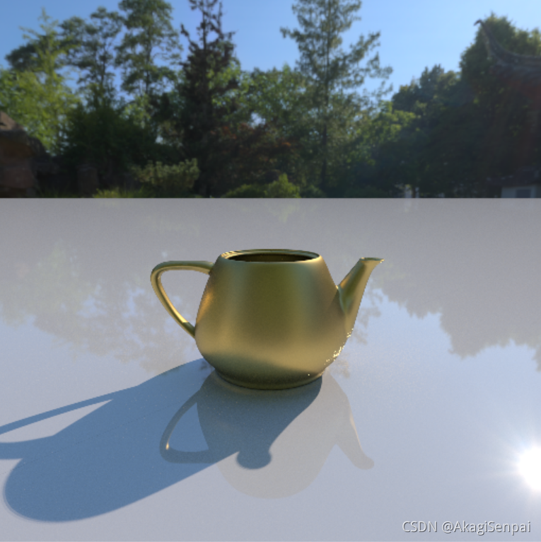
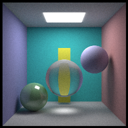
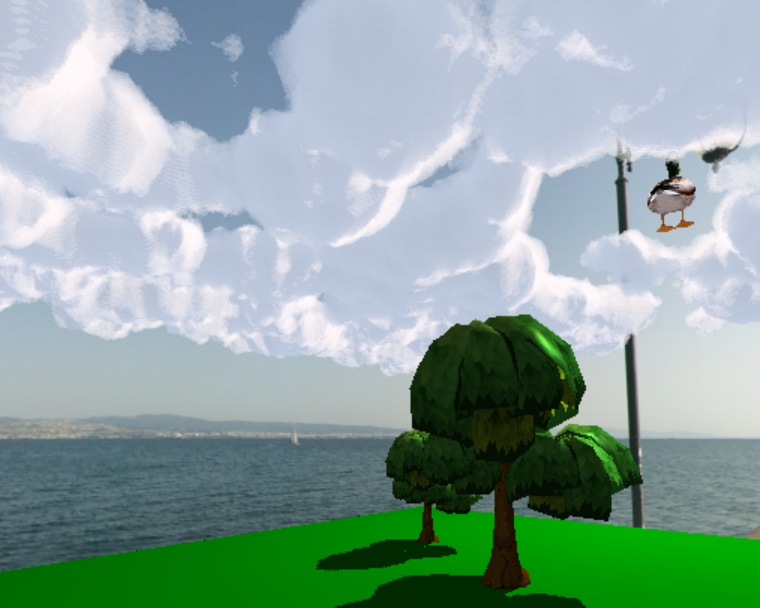
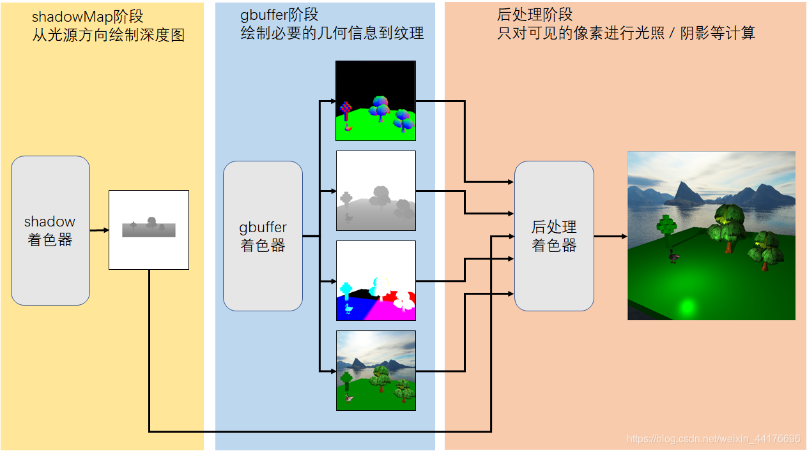

# Info
* 🏫 Edu: ShenZhen University, CSSE
* 📕 Blog: https://blog.csdn.net/weixin_44176696
* 🔍 Interest: computer graphic & rendering

# Overview 

# Projects

## EzRT

**Easy Raytracing Tutorial (EzRT)** is a lite code, simple tutorial for beginners to learn raytracing, with OpenGL and C++, [learn more...](https://github.com/AKGWSB/EzRT) 

## HMS

**Hello Minecraft Shaders (HMS)** is a simple tutorial about how to programming shaders for Minecraft, based on [Optifine mod](https://github.com/sp614x/optifine) environment, [learn more...](https://github.com/AKGWSB/Hello-Minecraft-Shaders) 

# Articles

Some blogs written when my college years, I personally highly recommend u to have a read...

## Technical Artist

[浅谈《原神》中的图形渲染技术](https://blog.csdn.net/weixin_44176696/article/details/114176844?spm=1001.2014.3001.5501) 

## Ray Tracing

[光线追踪渲染实战（五）：低差异序列与重要性采样，加速收敛！](https://blog.csdn.net/weixin_44176696/article/details/119988866?spm=1001.2014.3001.5501) 

[光线追踪渲染实战：蒙特卡洛路径追踪及其c++实现](https://blog.csdn.net/weixin_44176696/article/details/113418991?spm=1001.2014.3001.5501) 

## OpenGL

[光线追踪渲染实战（三）：OpenGL 光线追踪，用 GPU 加速计算！](https://blog.csdn.net/weixin_44176696/article/details/119044396) 

[体积云渲染实战：ray marching，体积云与体积云光照](https://blog.csdn.net/weixin_44176696/article/details/113090350?spm=1001.2014.3001.5501)

[OpenGL学习（十一）：延迟渲染管线](https://blog.csdn.net/weixin_44176696/article/details/112987749?spm=1001.2014.3001.5501) 

# Music Recommendation

我贼喜欢这歌，[Desert Years,  Yana](https://music.163.com/#/song?id=28178007) ，冷门底边车万同人曲，这玩意我至今没听出原曲是啥（其实是《デザイアドライブ》，是由上海爱丽丝幻乐团制作的东方 project 系列游戏《东方神灵庙》中第四关的 bgm）但是并不妨碍这玩意的旋律像若子的 24 K 纯冰一样灌进脑子里面。我至今不知道这玩意怎么在现代设备高达 24842 KHZ 的声卡调出听起来像上世纪 90 年代 FC 机一样的 8 bit 一般的伴奏（其实仔细一听挺顺滑的），就像把耳机插在交换机的 trunk port 上（❓）。这 b 歌的旋律荒诞的就像荒诞的我在荒诞的 VR 三体世界中荒诞的奔跑，三个无序的太阳投下三个南辕北辙的影子。歌名 desert Years，正如我过着 desert 的人生，却追逐 (desire) 着美好的 Years 一样... 不过 Desert Year 读出来就是 desire，这一点歌词也是对上的，大概作者的电波也是这个逻辑？

# About name

AKG is for Akagi Senpai in Azure Lane, while WSB is for ███

# 开摆！

编不下去了，开摆！

<!--
**AKGWSB/AKGWSB** is a ✨ _special_ ✨ repository because its `README.md` (this file) appears on your GitHub profile.

Here are some ideas to get you started:

- 🔭 I’m currently working on ...
- 🌱 I’m currently learning ...
- 👯 I’m looking to collaborate on ...
- 🤔 I’m looking for help with ...
- 💬 Ask me about ...
- 📫 How to reach me: ...
- 😄 Pronouns: ...
- ⚡ Fun fact: ...
-->
